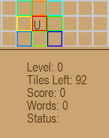
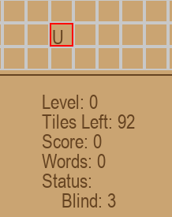
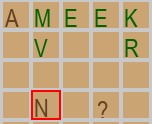
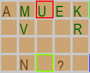

# Jumpbble
Scrabble roguelike.

-----

## Table-of-Contents
* [Player Movement](#player-movement)
* [Effects](#effects)
    * [Ordered](#ordered)
    * [Diagonal](#diagonal)
    * [Wildcard](#wildcard)
    * [Jump](#jump)
    * [Blind](#blind)
    * [Erase](#erase)
    * [Mirror](#mirror)
* [Levels]()
* [Items]()
* [Scoring](#scoring)
* [Configuration](#configuration)

-----

## Player Movement
Players can move in all eight directions.

Alternatively, left-clicking a highlighted tile will move a player.

The number of spaces moved is based on the index of the current letter tile:
* `A` -> `1`
* `B` -> `2`
* `O` -> Any number of spaces.
* `*` -> Wildcard. So any number of spaces

Moves at the edge of the grid continue on the the opposite edge of the grid.

-----

## Effects
Effects are triggered by landing on a special, randomized `'?'` tile.

### Ordered
* Refilled letters will follow the order of the last placed tile.
* Ex. `A` -> `B` -> `C` ...

### Reversed (WIP)
* All placement is inverted.

### Cardinal (WIP)
* Cardinal placement only.

### Diagonal
* Diagonal placement only.
    

### Wildcard
* Entering a letter will replace the currently selected letter.
* This is unaffected by bag distribution.

### Jump
* Allows placement of a tile anywhere.
* **A free jump is given after completing a word.**

### Blind
* Lose ghost tiles temporarily.
    

    
    
    

### Erase
* Placing a letter on top of another will remove it.

### Mirror
* Piece placement is mirrored
    

-----

## Items

### Bomb (WIP)
* Destroy 1 block around placement.

### Wrapper (WIP)

-----

## Levels
Only one atm.

-----

## Scoring
Words do not need to connect to any existing words to be valid.

If a word is valid, all of the letters creating it will be highlighted green.
    

    
    
    

* Erasing a letter will not affect adjacent pre-existing green letter.
    * Points will not be awarded if a new word is not made.

Word validity is determined through the `pyenchant` package.
* This means that common abbreviations are valid (ex. `bn` for a billion).

## Configuration
To adjust letter distribution: `config/letters.json`
* `Number` refers to the number of tiles in a bag.
* `Score` is the amount of points awarded for each character in a valid word

To adjust special tile distribution: `config/special_tiles.json`
* Values represent the probability of an effect.

## Credit
Background music is ["NPC Theme" by **HoliznaCC0**](https://freemusicarchive.org/music/holiznacc0/chiptunes/npc-theme/) from the Free Music Archive.
